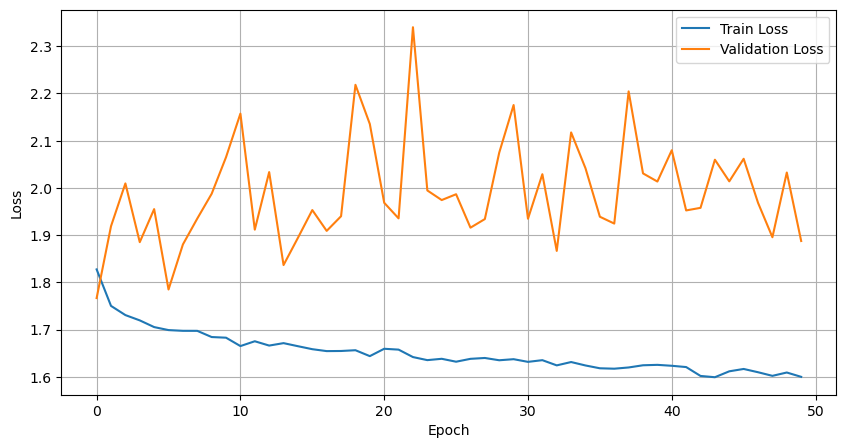
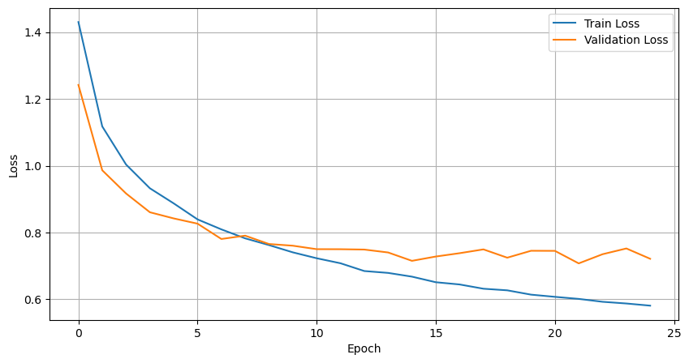
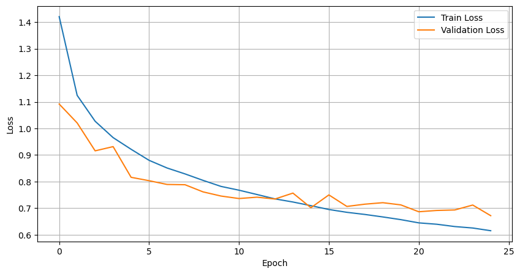
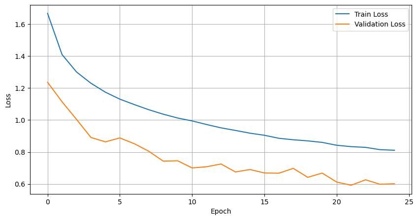
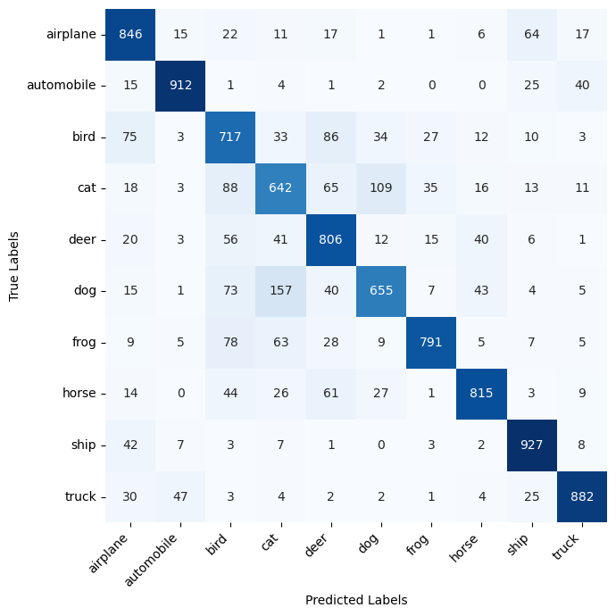
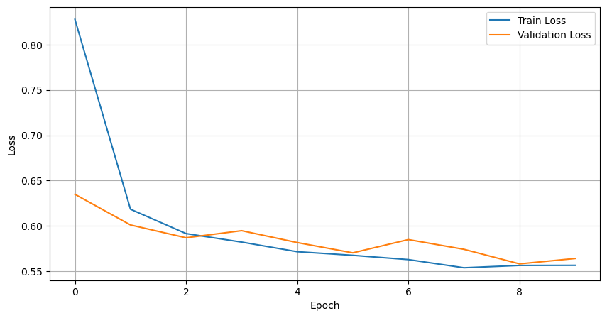

# Accuracy

[`tutorial.md`](../../tutorial.md)

## Linear Model

    

## Convolutional Neural Networks

<table>
  <tr>
    <th>Model</th>
    <th>Loss Progression</th>
  </tr>
  <tr>
    <td> 2 conv layers</td>
    <td></td>
  </tr>
  <tr>
    <td> 2 conv layers + batch normalization</td>
    <td></td>
  </tr>
  <tr>
    <td> 3 conv layers + batch normalization + dropout</td>
    <td></td>
  </tr>
</table>

    

## Transfer Learning

    

